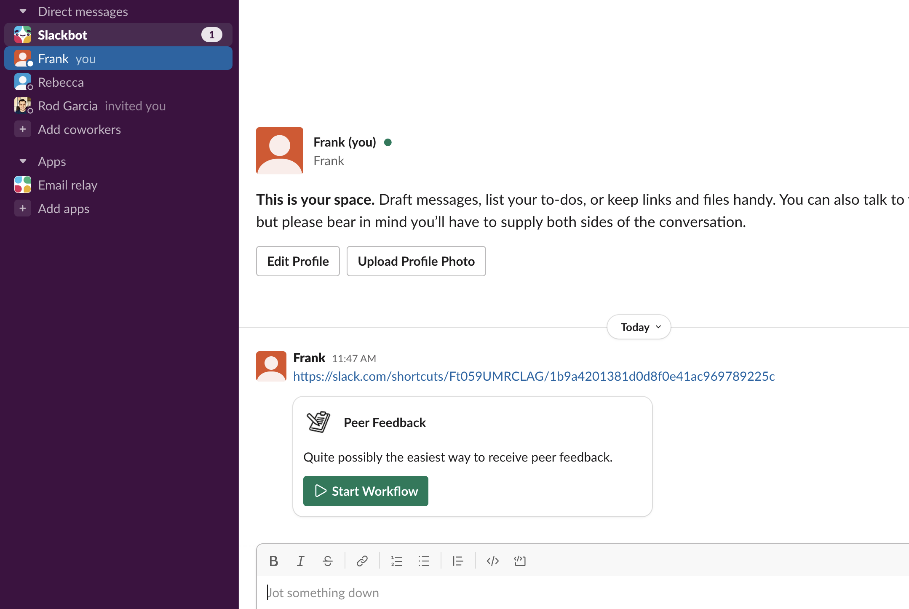
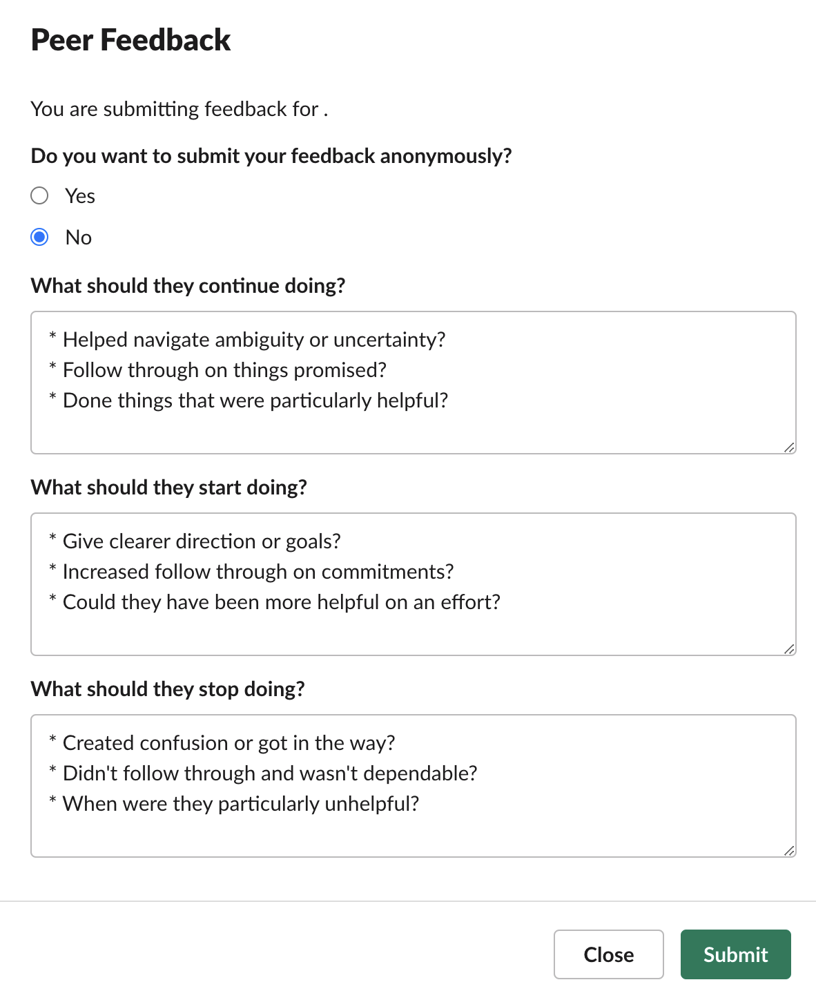

# Peer Feedback

This automation allows users to request, collect, and consolidate peer feedback in a private channel all within Slack. Lightweight way to encourage your teammates to actively invite feedback – rather than waiting for folks to give it to them. (h/t @KnowYourTeamHQ)



**Guide Outline**:

- [Included Workflows](#included-workflows)
- [Setup](#setup)
  - [Install the Slack CLI](#install-the-slack-cli)
  - [Clone the Template](#clone-the-template)
- [Running Your Project Locally](#running-your-project-locally)
- [Creating Triggers](#creating-triggers)
- [Workflow Usage](#workflow-usage)
  - [Setup Peer Feedback](#setup-peer-feedback)
  - [Request Peers](#request-peers)
  - [Give Feedback](#give-feedback)
- [Datastores](#datastores)
- [Deploying Your App](#deploying-your-app)
- [Future Considerations](#future-considerations)
- [Viewing Activity Logs](#viewing-activity-logs)
- [Capabilities Demonstrated](#capabilities-demonstrated)
- [Project Structure](#project-structure)
- [Resources](#resources)

---

## Included Workflows

- **Setup Workflow**: Creates a private channel for your peer feedback with instructions for next steps.
- **Request Peers**: Allows you to choose peers for feedback. Peers must be in the same workspace. After submission, a feedback form is DM'd to each of the peers.
- **Give Feedback**: A feedback form for the peers to submit feedback. The feedback is posted back to the requester's private channel. Feedback can be made anonymously.

## Setup

Before getting started, first make sure you have a development workspace where
you have permission to install apps. **Please note that the features in this
project require that the workspace be part of
[a Slack paid plan](https://slack.com/pricing).**

### Install the Slack CLI

To use this template, you need to install and configure the Slack CLI.
Step-by-step instructions can be found in our
[Quickstart Guide](https://api.slack.com/automation/quickstart).

### Clone the Template

Start by cloning this repository:

```zsh
# Clone this project onto your machine
$ slack create my-app -t hirefrank/slack-peer-feedback

# Change into the project directory
$ cd my-app
```

## Running Your Project Locally

While building your app, you can see your changes appear in your workspace in
real-time with `slack run`. You'll know an app is the development version if the
name has the string `(local)` appended.

```zsh
# Run app locally
$ slack run

Connected, awaiting events
```

To stop running locally, press `<CTRL> + C` to end the process.

## Creating Triggers

[Triggers](https://api.slack.com/automation/triggers) are what cause workflows
to run. These triggers can be invoked by a user, or automatically as a response
to an event within Slack.

When you `run` or `deploy` your project for the first time, the CLI will prompt
you to create a trigger if one is found in the `triggers/` directory. For any
subsequent triggers added to the application, each must be
[manually added using the `trigger create` command](#manual-trigger-creation).

When creating triggers, you must select the workspace and environment that you'd
like to create the trigger in. Each workspace can have a local development
version (denoted by `(local)`), as well as a deployed version. _Triggers created
in a local environment will only be available to use when running the
application locally._

### Link Triggers

A [link trigger](https://api.slack.com/automation/triggers/link) is a type of
trigger that generates a **Shortcut URL** which, when posted in a channel or
added as a bookmark, becomes a link. When clicked, the link trigger will run the
associated workflow.

Link triggers are _unique to each installed version of your app_. This means
that Shortcut URLs will be different across each workspace, as well as between
[locally run](#running-your-project-locally) and
[deployed apps](#deploying-your-app).

With link triggers, after selecting a workspace and environment, the output
provided will include a Shortcut URL. Copy and paste this URL into a channel as
a message, or add it as a bookmark in a channel of the workspace you selected.
Interacting with this link will run the associated workflow.

**Note: triggers won't run the workflow unless the app is either running locally
or deployed!**

### Manual Trigger Creation

You need to create two triggers for this automation. To manually create the first trigger, use the following command:

```zsh
$ slack trigger create --trigger-def triggers/setup.ts
```

then for the second:
```zsh
$ slack trigger create --trigger-def triggers/request.ts
```

You'll need to store the url of the second trigger as an [environment variable](https://api.slack.com/automation/environment-variables) called `workflow_request`. 

## Workflow Usage

### Setup Peer Feedback

With your app running locally (`slack run`), click the first link trigger you
created (`setup.ts`) -- you might want to send it to yourself your Slack workspace. The workflow's first step will create a private channel for your peer feedback with instructions on the next steps.

### Request Peers

This workflow is initiated from a button sent your to your private channel in a step in the
earlier workflow. This workflow allows you to pick multiple peers to give you feedback. Upon submission, each peer is sent a DM with a link to submit their feedback.

### Give Feedback

This workflow is triggered by a runtime link trigger created in a step in the
earlier workflow. The peer initiates the workflow by selcting the link and providing their feedback. Upon submission, the feedback is sent to requestor's private channel and a confirmation message is sent to the peer.



## Datastores

For storing data related to your app, datastores offer secure storage on Slack
infrastructure. For an example of a datastore, see `datastores/users.ts` -- it logs requestors and their private channel.
The use of a datastore requires the `datastore:write`/`datastore:read` scopes to
be present in your manifest.

## Future Considerations

- Write peer feedback to a Slack Canvas
- Allow a manager to request peer feedback on behalf of the employee
- Provide a mechanism for unsolicited feedback for an employee
- Write feedback back to a third-party system of record (e.g. Lattice)
- Use AI to generate summaries of feedback received
- Allow requestor to choose their own feedback questions
- Add peer feedback request as saved to later item

## Deploying Your App

Once development is complete, deploy the app to Slack infrastructure using
`slack deploy`:

```zsh
$ slack deploy
```

When deploying for the first time, you'll be prompted to
[create a new link trigger](#creating-triggers) for the deployed version of your
app. When that trigger is invoked, the workflow should run just as it did when
developing locally (but without requiring your server to be running). 

:bulb: Don't forget to repeat the steps to create the second link trigger and store the environement variable.

## Viewing Activity Logs

Activity logs of your application can be viewed live and as they occur with the
following command:

```zsh
$ slack activity --tail
```

## Capabilities Demonstrated
- Multiple Workflows
- Creating a Private Channel
- Posting Messages
- Forms
- Custom Functions
- Workflow Buttons
- Runtime Link Triggers
- Datastores
- Environment Variables

## Project Structure

### `.slack/`

Contains `apps.dev.json` and `apps.json`, which include installation details for
development and deployed apps.

### `datastores/`

[Datastores](https://api.slack.com/automation/datastores) securely store data
for your application on Slack infrastructure. Required scopes to use datastores
include `datastore:write` and `datastore:read`.

### `functions/`

[Functions](https://api.slack.com/automation/functions) are reusable building
blocks of automation that accept inputs, perform calculations, and provide
outputs. Functions can be used independently or as steps in workflows.

### `triggers/`

[Triggers](https://api.slack.com/automation/triggers) determine when workflows
are run. A trigger file describes the scenario in which a workflow should be
run, such as a user pressing a button or when a specific event occurs.

### `workflows/`

A [workflow](https://api.slack.com/automation/workflows) is a set of steps
(functions) that are executed in order.

Workflows can be configured to run without user input or they can collect input
by beginning with a [form](https://api.slack.com/automation/forms) before
continuing to the next step.

### `manifest.ts`

The [app manifest](https://api.slack.com/automation/manifest) contains the app's
configuration. This file defines attributes like app name and description.

### `slack.json`

Used by the CLI to interact with the project's SDK dependencies. It contains
script hooks that are executed by the CLI and implemented by the SDK.

## Resources

To learn more about developing automations on Slack, visit the following:

- [Automation Overview](https://api.slack.com/automation)
- [CLI Quick Reference](https://api.slack.com/automation/cli/quick-reference)
- [Samples and Templates](https://api.slack.com/automation/samples)
